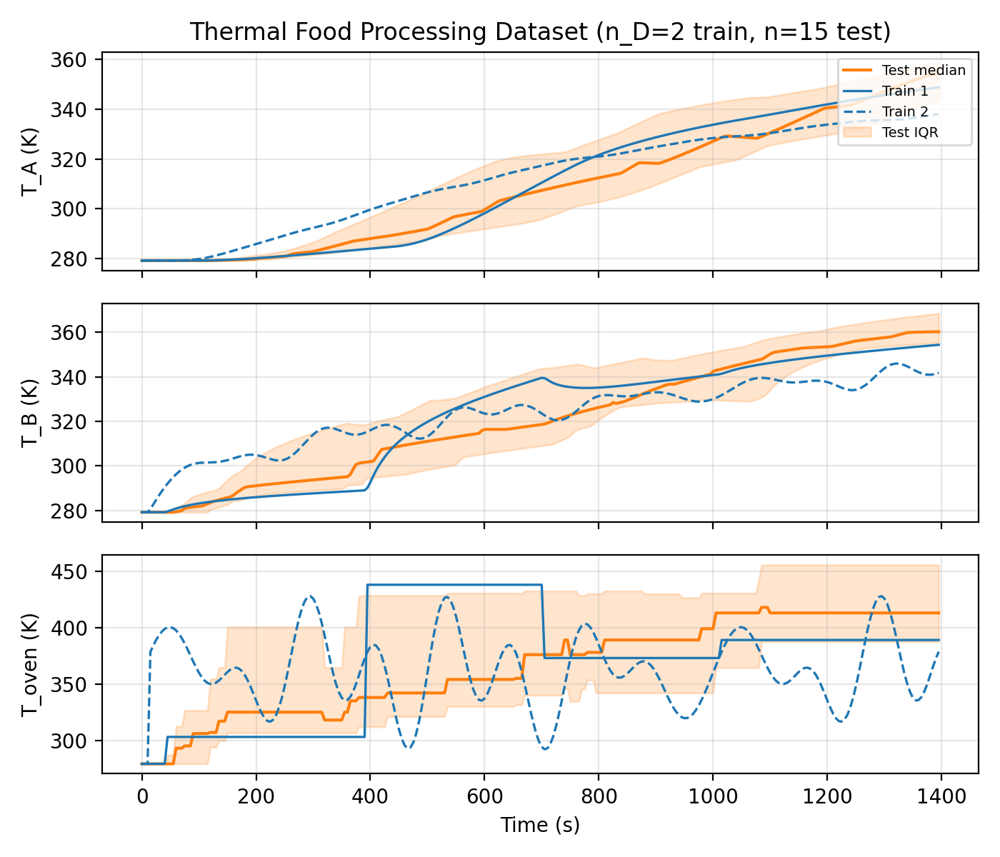
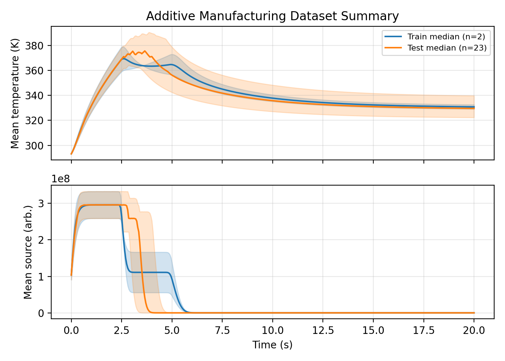

# Stable Port-Hamiltonian Neural Networks (S-PHNN)

* **Paper:** 
* **GitHub:** [CPShub/sphnn-publication](https://github.com/CPShub/sphnn-publication)
* **Casmir Control Experiment GitHub:**  [rfarell/casmir-control](https://github.com/rfarell/casmir-control)


---

## Casmir Control


# Analysis: Experiment One (Tier A0.1)

**The Ito correction reduces SO(3) constraint drift by 5-16x (AUC) and 6-19x (max) without sacrificing trajectory accuracy.**

We tested whether adding the Stratonovich -> Ito drift correction to an ambient Euler-Maruyama integrator keeps rotation matrices closer to SO(3). It does. Across three timestep sizes (dt = 0.005, 0.01, 0.02), the corrected integrator (I3) dramatically outperforms the baseline (I0) on constraint drift while matching or slightly improving geodesic error against a geometry-faithful gold reference (I4).

---

## Results at a Glance

| dt | I0 median max drift | I3 median max drift | Improvement | Geodesic error (I3 <= I0?) |
|----|--------------|--------------|-------------|---------------------------|
| 0.005 | 1.49 | 0.08 | **19x** | OK (0.0033 vs 0.0033) |
| 0.010 | 1.64 | 0.16 | **10x** | OK (0.0053 vs 0.0057) |
| 0.020 | 1.95 | 0.35 | **6x** | OK (0.0096 vs 0.0101) |

I4 (gold) stays at machine precision (~1e-14) throughout.

---

## What We Did

**System:** Pure SO(3) kinematics with time-varying angular velocity omega(t) = [sin(0.5t), 0.5cos(0.5t), 0.2] and anisotropic diffusion sigma = (0.10, 0.17, 0.06). No dynamics, no learning--just integrator comparison.

**Integrators:**
- **I0:** Ambient Euler-Maruyama (baseline) -- updates R in R^{3x3}, drifts off SO(3)
- **I3:** Ambient EM + Ito correction -- adds 1/2 R (sum_i sigma_i^2 A_i^2) dt to compensate for Stratonovich->Ito conversion
- **I4:** Stochastic exponential Euler (gold) -- updates via R <- R * exp(delta_hat), stays on SO(3) by construction

**Protocol:**
- Generate Brownian paths at dt_gold = 0.001
- Run I4 at dt_gold to produce gold trajectories
- Run I0/I3 at coarser dt_eval in {0.005, 0.01, 0.02} using summed increments
- Same noise realization for all methods (fair comparison)
- N = 200 trajectories, T = 20s

---

## Metrics

- **Constraint drift:** ||R^T R - I||_F (should be 0 for valid SO(3))
- **Geodesic error:** ||log(R_gold^T R_proj)|| (trajectory accuracy vs gold, with R_proj from polar projection)
- **Drift AUC:** int_0^T ||R^T R - I||_F dt (cumulative drift)

---

## Figures and Analysis

### Constraint Drift at dt = 0.005


**Left panel (||R^T R - I||_F):** The orthogonality error over 20 seconds. I0 (blue) climbs steadily to ~1.5, meaning R has drifted far from any valid rotation matrix. I3 (orange) stays nearly flat at ~0.08--the Ito correction is working. I4 (green) is invisible at zero because it stays on SO(3) by construction.

**Right panel (|det R  - 1|):** The determinant deviation mirrors the orthogonality error. I0's determinant drifts to ~1.5 away from 1, while I3 keeps it close to unity.

**Takeaway:** The correction provides an order-of-magnitude reduction in constraint violation at practical timesteps.

---

### Geodesic Error at dt = 0.005


This shows trajectory accuracy: how far is each method's rotation from the gold trajectory (measured by geodesic distance on SO(3) after projecting to the nearest valid rotation)?

All three curves are nearly identical and small (~0.003 rad). I3 does not sacrifice trajectory accuracy to achieve lower drift--it slightly outperforms I0. This confirms the Ito correction is not distorting the dynamics, just keeping R valid.

---

### Constraint Drift at dt = 0.01


With a larger timestep, both methods accumulate more drift, but the pattern holds: I0 reaches ~1.6, I3 stays at ~0.16. The improvement ratio drops from 19x to 10x as expected--larger steps give the correction less opportunity to compensate--but I3 still dominates.

---

### Geodesic Error at dt = 0.01


Geodesic error increases slightly with larger dt (now ~0.005 rad), but I3 remains comparable to I0. No regression.

---

### Constraint Drift at dt = 0.02


At the coarsest timestep tested, I0 drift approaches 2.0 and I3 reaches ~0.35. The 6x improvement is smaller than at finer dt, but still substantial. This shows the correction's benefit degrades gracefully--it doesn't suddenly fail at large dt.

---

### Geodesic Error at dt = 0.02


Even at dt = 0.02, geodesic error stays below 0.01 rad for both methods, with I3 slightly better. The Ito correction maintains trajectory fidelity across the full dt range.

---

## Key Findings

### 1. Drift reduction is dramatic and consistent

At dt = 0.005:
- I0 accumulates drift to ||R^T R - I|| ~ 1.49 by T = 20s
- I3 stays at ~ 0.08 -- a **19x reduction**

The correction works across all tested timesteps. Larger dt means more drift for both methods, but I3 degrades gracefully while I0 explodes.

### 2. Trajectory accuracy is preserved

Geodesic error at T = 20s:
- I3 matches or slightly beats I0 at every dt
- This confirms the correction doesn't trade manifold fidelity for trajectory accuracy

### 3. The effect is not from projection

We also tracked ||R - R_proj|| (distance to nearest SO(3) matrix). For I0, this distance equals the drift--meaning I0's R is far from any valid rotation. For I3, both metrics are small, confirming the correction keeps R close to SO(3) intrinsically, not via post-hoc projection.

---

## Decision

**Pass.** Tier A0.1 criteria satisfied:
- Drift AUC improves by >=3x (actual: 5-16x)
- Geodesic error does not regress
- Max drift reduced by order of magnitude

**Next:** Proceed to Tier A0.2 (full rigid-body SDE with gravity/damping) or directly to Tier B (learning).

---

## Technical Notes

- **Micro-test (single step from R=I, omega=0):** I0 mean drift = 2.99e-4, I3 = 2.62e-4. Confirms correction direction is correct.
- **Convention:** Left action (dR = R*(...)). Casimir term applied on left with sign +1.
- **Reproducibility:** Seed 1234 for rotations, 1235 for noise. Full config in `configs/exp1_config.py`.


## Architecture


## Notes
----
Here's a useful "family tree" that matches how the paper is grouping things, plus the *exact* reference papers the authors attach to each framework.


CONSERVATIVE / ENERGY-CONSERVING (no built-in dissipation term)

1. Lagrangian mechanics (configuration-space variational form)

* Core idea: pick a Lagrangian (L(q,\dot q)) and derive dynamics from stationarity of the action (\int L,dt) (Euler-Lagrange equations). Energy conservation follows when (L) has no explicit time dependence and you don't add nonconservative forces.
* Relationship: often the "most primitive" starting point in mechanics; Hamiltonian form comes from a Legendre transform (p=\partial L/\partial \dot q).
* Papers cited in this paper under "Lagrangian mechanics":

  * [10] Cranmer et al., "Lagrangian Neural Networks" 
  * [34] Lutter et al., "Deep Lagrangian Networks: Using Physics as Model Prior for Deep Learning" 

2. Hamiltonian mechanics (canonical symplectic form; energy as Hamiltonian)

* Core idea: dynamics on ((q,p)) via
  [
  \dot z = J \nabla H(z),\qquad
  J=\begin{bmatrix}0&I\-I&0\end{bmatrix},
  ]
  so the flow is energy-conserving (for autonomous (H)) and volume-preserving.
* "ML flavor": learn (H) (or a symplectic integrator / symplectic map) so the learned dynamics remain structure-preserving.
* Papers cited here under "Hamiltonian mechanics":

  * [9] Choudhary et al., "Forecasting Hamiltonian Dynamics without Canonical Coordinates" 
  * [16] Greydanus et al., "Hamiltonian Neural Networks" 
  * [20] Jin et al., "SympNets: Intrinsic Structure-Preserving Symplectic Networks for Identifying Hamiltonian Systems" 

3. Poisson systems (noncanonical Hamiltonian; allows degeneracy + Casimirs)

* Core idea: generalize symplectic (J) to a state-dependent Poisson tensor (J(x)) (skew-symmetric, satisfies Jacobi identity):
  [
  \dot x = J(x)\nabla H(x).
  ]
  Still conservative, but (J(x)) can be singular; invariants called **Casimir functions** can appear from the degeneracy.
* Paper cited here under "Poisson systems":

  * [19] Jin et al., "Learning Poisson Systems and Trajectories ... via Poisson Neural Networks" 

NON-CONSERVATIVE / THERMODYNAMICALLY CONSISTENT (built-in dissipation)

4. Generalized Onsager principle (dissipation as a variational/gradient-flow principle)

* Core idea (informal but accurate): dynamics follow from minimizing a dissipation potential / entropy production subject to constraints; mathematically you often get a **gradient flow**
  [
  \dot x = -M(x)\nabla \Phi(x),
  ]
  with (M(x)\succeq 0) a mobility / friction operator and (\Phi) a free energy (Lyapunov-like). "Generalized" versions can couple reversible + irreversible parts.
* Paper cited here:

  * [55] Yu et al., "OnsagerNet: Learning Stable and Interpretable Dynamics Using a Generalized Onsager Principle" 

5. GENERIC (General Equation for Non-Equilibrium Reversible-Irreversible Coupling)

* Core idea: explicitly split **reversible** and **irreversible** parts:
  [
  \dot x = L(x)\nabla E(x) ;+; M(x)\nabla S(x),
  ]
  where (L) is skew (Poisson-like), (M\succeq 0) is symmetric (dissipation/metric), (E) is energy, (S) is entropy, plus "degeneracy conditions" that enforce the 1st/2nd laws (energy conserved by the dissipative part; entropy not decreased by the reversible part).
* Papers cited here under "GENERIC":

  * [18] Hernandez et al., "Structure-Preserving Neural Networks" 
  * [56] Zhang et al., "GFINNs: GENERIC Formalism Informed Neural Networks ..." 

CONTROL-FRIENDLY DISSIPATIVE (energy + dissipation + ports/inputs)

6. Port-Hamiltonian systems (PHS / PHS with control ports)

* Core idea: extend Hamiltonian form to include dissipation and explicit inputs ("ports"):
  [
  \dot x = (J(x)-R(x))\nabla H(x) + G(x)u(t),
  ]
  with (J=-J^\top), (R=R^\top\succeq 0). This gives a clean energy balance inequality ("can't gain energy without input") and is why they say PHS are especially suited for controlled systems. (This is exactly the paper's point in the paragraph you screenshot.) 
* Papers cited here under "port-Hamiltonian systems (PHS)":

  * [11] Desai et al., "Port-Hamiltonian Neural Networks ..." 
  * [13] Eidnes et al., "Pseudo-Hamiltonian Neural Networks with State-Dependent External Forces" 
  * [37] Nakano et al., "Model Estimation Ensuring Passivity ... Using Port-Hamiltonian Model and Deep Learning" 
  * [38] Neary & Topcu, "Compositional Learning ... Using Port-Hamiltonian Neural Networks" 
  * [57] Zhong et al., "Dissipative SymODEN: ... Hamiltonian Dynamics with Dissipation and Control ..." 
* Background/control theory anchor they cite elsewhere in the refs (good for "what is PHS really?"):

  * [51] van der Schaft & Jeltsema, *Port-Hamiltonian Systems Theory: An Introductory Overview* 

Now, adding Casimir control (as you requested)

7. Casimir / energy-Casimir control (a.k.a. control by interconnection + energy shaping)

* Where it sits: this is **not** a separate modeling framework like "Hamiltonian vs GENERIC"; it's a **control design method** that lives naturally inside **Poisson / port-Hamiltonian** theory.
* Core idea: a **Casimir function** (C(x)) is an invariant tied to the interconnection structure (Poisson/Dirac). In control-by-interconnection, you couple ("interconnect") a controller system to the plant so that certain Casimirs become invariants of the closed loop; then you shape the closed-loop energy (Hamiltonian) to have a minimum at the desired equilibrium. This is the essence of passivity-based / energy-shaping control for PHS.
* Canonical references (outside this sPHNN paper's numbered list):

  * Ortega, van der Schaft, Maschke, Escobar (2002), "Interconnection and damping assignment passivity-based control of port-controlled Hamiltonian systems" (IDA-PBC; energy shaping + damping injection; Casimirs appear in the interconnection view). ([ScienceDirect][1])
  * Maschke, Ortega, van der Schaft (2000), "Energy-Based Lyapunov Functions for Forced Hamiltonian Systems with Dissipation" (energy-Casimir style Lyapunov construction for nonzero equilibria). ([University of Groningen Research][2])
  * (If you want the "gotchas" literature) "Casimir-Based Control Beyond the Dissipation Obstacle" (2012) discusses a key limitation of naive Casimir-based designs when dissipation is present. ([ScienceDirect][3])

A compact "one-line" hierarchy (mechanics -> thermodynamics -> control) that usually matches how people think about it:

* Lagrangian (action on ((q,\dot q))) -> Hamiltonian (symplectic ((q,p))) -> Poisson (noncanonical Hamiltonian; Casimirs)
* Add dissipation + 2nd law constraints: Onsager (gradient-flow / dissipation potential) and GENERIC (Poisson + metric coupling of reversible/irreversible)
* Add explicit ports/inputs for interconnection/control: Port-Hamiltonian -> energy shaping / Casimir (control design layer)

If you want to go deeper next, the most clarifying move is to write the "canonical forms" side-by-side (Hamiltonian vs Poisson vs PHS vs GENERIC vs OnsagerNet) and mark exactly which operator is skew, which is PSD, and which potential is being decreased--then everything becomes bookkeeping.

[1]: https://www.sciencedirect.com/science/article/abs/pii/S0005109801002783?utm_source=chatgpt.com "Interconnection and damping assignment passivity-based control of port-controlled Hamiltonian systems - ScienceDirect"
[2]: https://research.rug.nl/en/publications/energy-based-lyapunov-functions-for-forced-hamiltonian-systems-wi-2?utm_source=chatgpt.com "Energy-Based Lyapunov Functions for Forced Hamiltonian Systems with Dissipation - the University of Groningen research portal"
[3]: https://www.sciencedirect.com/science/article/abs/pii/S1474667015337629?utm_source=chatgpt.com "Casimir-Based Control Beyond the Dissipation Obstacle - ScienceDirect"


-----


## Main Algorithm

### Mathematical Form (The Model Class)

They learn continuous-time dynamics in **port-Hamiltonian** form:

$$
\dot{x} = \big(J(x)-R(x)\big)\nabla_x H(x) + G(x)u(t)
$$

where:
* $J(x) = -J(x)^\top$ (conservative interconnection matrix)
* $R(x) = R(x)^\top \succeq 0$ (dissipation matrix)
* $G(x)$ (input port matrix)

This structure implies the standard **dissipativity/energy balance** $\dot{H} \le s(x,u)$ (and $\dot{H} \le 0$ if $u=0$).

### Core Architectural Trick (Stability by Construction)

To guarantee a **globally stable equilibrium** (for the unforced system), they enforce Theorem 3.1's conditions by making the Hamiltonian $H$ **convex with a strict minimum**.

**Hamiltonian Parameterization**

1.  Build a convex scalar function $f(x)$ using a **Fully Input Convex Neural Network (FICNN)**:
    $$
    z_1 = \sigma_0(W_0 x + b_0), \quad z_{i+1} = \sigma_i(U_i z_i + W_i x + b_i), \quad f(x) = z_k
    $$
    *(where $U_i$ are constrained to be non-negative)*.

2.  "Normalize" it so the equilibrium $x^*$ is a global minimum where $\nabla H(x^*) = 0$:
    $$
    H(x) = f(x) - f(x^*) - \nabla f(x^*)^\top (x - x^*) + \epsilon \|x - x^*\|^2
    $$
    *(The middle terms ensure the gradient is zero at $x^*$, and the quadratic term is an optional strictness regularizer.)*
    
    $x^*$ can be **fixed from prior knowledge** or learned as a parameter (sPHNN-LM).

**Matrix Parameterization (J, R, G)**

* $J(x)$: Feed-forward NN (FFNN) output mapped to a **skew-symmetric** matrix ($A - A^\top$).
* $R(x)$: Enforced to be Positive Semi-Definite (PSD) via **Cholesky decomposition** ($R = LL^\top$) with $L$ being lower-triangular (diagonal elements constrained $\ge 0$ or $>0$).
* $G(x)$: FFNN output reshaped to $n \times m$.

### Loss / Training Algorithm

They train by minimizing **mean squared error** using **Adam**. The loss depends on data availability:

**Derivative Fitting (when $\dot{x}$ is available):**
$$
\mathcal{L}_{\text{deriv}}(\theta) = \frac{1}{N} \sum_{i=1}^N \big\| \hat{\dot{x}}_\theta(x_i, u_i) - \dot{x}_i \big\|^2
$$
[cite_start]*(where $\hat{\dot{x}}_\theta$ is given by the port-Hamiltonian RHS defined above)* [cite: 1]

**Trajectory Fitting (when only trajectory points are available):**
Integrate the learned ODE to get $\hat{x}_\theta(t_k)$, then:
$$
\mathcal{L}_{\text{traj}}(\theta) = \frac{1}{\sum_j K_j} \sum_j \sum_{k=1}^{K_j} \big\| \hat{y}_\theta(t_k) - y(t_k) \big\|^2
$$
*(with $\hat{y}$ typically a readout or subset of $\hat{x}$)*. [cite_start]Gradients are computed via backpropagation through the solver or adjoint sensitivity methods. [cite: 1]

[cite_start]For rollouts, they use an adaptive Runge-Kutta solver (Tsit5) with known $u(t)$. [cite: 1]


## Limitations

**1. Reliance on Prior Knowledge of Equilibria**
The architecture is primarily designed for systems where the stable equilibrium point is **known a priori** (typically shifted to $\mathbf{x}=0$). While the authors mention that equilibrium points *can* be learned, the stability guarantees and experiments heavily rely on enforcing the Hamiltonian to have a strict minimum at a pre-defined location.

**2. Dependence on External Dimensionality Reduction**
For high-dimensional systems (like the thermal PDE experiments), the model relies on external techniques (e.g., Autoencoders or POD) to project data into a low-dimensional latent space. The stability guarantees apply only to the **latent dynamics**; if the mapping between the high-dimensional physical space and the latent space is poor or unstable, the overall physical prediction can still fail.

**3. Strong Inductive Bias (Reduced Flexibility)**
By strictly enforcing physical laws (energy conservation via skew-symmetry and dissipation via positive semi-definiteness), the model has a very strong "inductive bias." This can make it **less flexible** than standard black-box neural networks when trying to fit real-world data that may contain noise, measurement errors, or non-physical artifacts that strictly violate PHS dynamics.

**4. Increased Training Complexity**
Enforcing the necessary mathematical constraints--specifically the **convexity** of the Hamiltonian (via Input Convex Neural Networks) and the **positive semi-definiteness** of the dissipation matrix (via Cholesky decomposition)--adds significant computational overhead and architectural complexity compared to training standard unconstrained neural networks.

**5. Identifiability Challenges**
While the model guarantees stability, uniquely separating the dynamics into the interconnection ($J$), dissipation ($R$), and Hamiltonian ($H$) components purely from trajectory data is theoretically difficult. Without sufficient excitation or regularization, the model might learn a "mathematically correct" but "physically meaningless" decomposition (e.g., attributing energy loss to the wrong term).

## Comparison between S-PHNN [1] and PHNN [2]

### **1. Core System Dynamics**

Both methods aim to learn dynamics governed by the Port-Hamiltonian System (PHS) formulation, generally written as:
$$\dot{x} = [J(x) - R(x)] \nabla H(x) + G(x)u(t)$$
However, they make different assumptions to simplify or constrain this equation.

* **Desai et al. (2021):**
    * **Focus:** Non-autonomous systems with explicit time-dependent forces (e.g., chaotic forced oscillators).
    * **Formulation:** They simplify the general PHS by assuming **canonical coordinates** (separating position $q$ and momentum $p$) and often approximating damping as state-independent.
    * **Equation:**
        $$\begin{pmatrix} \dot{q} \\ \dot{p} \end{pmatrix} = \underbrace{\begin{pmatrix} 0 & I \\ -I & 0 \end{pmatrix}}_{J} \nabla H(q,p) - \underbrace{\begin{pmatrix} 0 & 0 \\ 0 & D \end{pmatrix}}_{R} \nabla H(q,p) + \underbrace{\begin{pmatrix} 0 \\ F(t) \end{pmatrix}}_{Force}$$
    * Here, the interconnection matrix $J$ is fixed to the standard symplectic matrix, and the external influence is modeled as a direct time-dependent force vector $F(t)$ rather than a state-dependent port $G(x)u(t)$.

* **Roth et al. (2025) (S-PHNN):**
    * **Focus:** Global Lyapunov stability, control systems, and surrogate modeling.
    * **Formulation:** They strictly enforce the general PHS structure with **state-dependent** matrices for both energy conservation and dissipation.
    * **Equation:**
        $$\dot{x} = [J(x) - R(x)] \nabla H(x) + G(x)u(t)$$
    * They learn the full functions $J(x)$, $R(x)$, $H(x)$, and $G(x)$ without assuming canonical coordinates or constant damping.

### 2. Structural Constraints & Parameterization

The primary mathematical difference lies in how they parameterize the matrices to enforce physical laws.

| Component | **Desai et al. (2021)** | **Roth et al. (2025)** |
| :--- | :--- | :--- |
| **Interconnection ($J$)** | **Fixed** or Soft-Constrained. Typically assumes the canonical form $\begin{pmatrix} 0 & I \\ -I & 0 \end{pmatrix}$. | **Learned & Strictly Constrained.** Parameterized as $J(x) = A(x) - A(x)^T$ to guarantee skew-symmetry ($J^T = -J$) everywhere. |
| **Dissipation ($R$)** | **Simplified.** Often modeled as a constant matrix $D$ (or $N$), typically diagonal or restricted to momentum states. Positive definiteness is often a soft constraint. | **Learned & Strictly Constrained.** Parameterized via Cholesky decomposition $R(x) = L(x)L(x)^T$ to strictly guarantee it is Positive Semi-Definite (PSD) ($y^T R y \ge 0$). |
| **Hamiltonian ($H$)** | Parameterized by a standard Neural Network (e.g., MLP). | Parameterized by a **Fully Input Convex Neural Network (FICNN)** to ensure convexity and global stability. |
| **External Inputs** | Modeled as an explicit time-dependent function $F(t)$ learned directly. | Modeled as an input port $G(x)u(t)$, separating the state-dependent input matrix $G(x)$ from the control signal $u(t)$. |

### 3. Stability Guarantees

* **Desai et al. (2021):** Captures the *structure* of a PHS, improving learning of chaotic/dissipative systems. However, it does not strictly enforce the mathematical properties required for **Global Lyapunov Stability** (i.e., proving that energy always decays to a stable equilibrium in the absence of input).
* **Roth et al. (2025):** The "Stable" in S-PHNN refers to a mathematical guarantee. By rigorously enforcing $J^T = -J$ and $R \succeq 0$ via the architecture itself (projection-free) and enforcing Hamiltonian convexity, they ensure $\dot{H} \le 0$ for zero input. This guarantees the system is **passivity-preserving** and theoretically stable.


## Experiments

Here are the four datasets described in technical detail, including their governing equations and Hamiltonian structures where applicable.

### 1. Spinning Rigid Body (Conservative)
This is a canonical Hamiltonian system modeling a rigid body rotating in 3D space without external torques or friction. It serves as the primary test for energy conservation.

* **State Space:** $\boldsymbol{x} = \boldsymbol{\omega} = [\omega_1, \omega_2, \omega_3]^\top \in \mathbb{R}^3$ (angular velocities).
* **Hamiltonian (Total Energy):**
    The system is conservative. The Hamiltonian is the rotational kinetic energy:
    $$H(\boldsymbol{\omega}) = \frac{1}{2} \boldsymbol{\omega}^\top \mathbf{I} \boldsymbol{\omega}$$
    where $\mathbf{I} = \text{diag}(I_1, I_2, I_3)$ is the moment of inertia tensor.
* **Dynamics (Euler's Equations):**
    The motion is governed by:
    $$\mathbf{I} \dot{\boldsymbol{\omega}} = (\mathbf{I} \boldsymbol{\omega}) \times \boldsymbol{\omega}$$
    In Port-Hamiltonian form $\dot{x} = (J(x) - R(x)) \nabla H(x)$, we have:
    * **Dissipation:** $R(x) = 0$ (Zero matrix).
    * **Interconnection:** $J(x)$ is the state-dependent skew-symmetric matrix representing the cross-product operation:
        $$J(\boldsymbol{\omega}) = \mathbf{I}^{-1} \begin{bmatrix} 0 & -\omega_3 I_3 & \omega_2 I_2 \\ \omega_3 I_3 & 0 & -\omega_1 I_1 \\ -\omega_2 I_2 & \omega_1 I_1 & 0 \end{bmatrix} \mathbf{I}^{-1}$$
* **Data generation (from `experiments/spinning_rigid_body/spinning_rigid_body.ipynb`):**
    * **Parameters:** $\mathbf{I} = \text{diag}(1,2,3)$, $\mu = 0.01$ (set $\mu = 0$ for strictly conservative)
    * **Train time grid:** $t \in [0, 50]$ with $N = 1000$ points, so $\Delta t = 50/999 \approx 0.05005$s.
    * **Test time grid:** $t \in [0, 200]$ with $N = 1000$ points, so $\Delta t = 200/999 \approx 0.20020$s.
    * **Initial conditions:** $x_0 \sim \text{Uniform}(0,1)^3$, then squared component-wise (`x0s_train = x0s_train**2`), seed 0.
        * Note: as written `x0s_test = x0s_train**2`, so test ICs are deterministic from the train samples (fourth power from the original uniform draw), not a fresh draw. 
    * **Derivative data:** analytic $\dot{\omega}$ evaluated on each grid and flattened. 
* **Dataset sizes:** 
    * **Train trajectories:** 10 x 1000 = 3 $\rightarrow{}$ 10,000 time samples
    * **Test trajectories:** 10 x 1000 $\rightarrow$ 10,000 time samples
    * **Derivative data:** 10,000 x 3 samples per split (flattened grid).
* **Dataset visualization:**

* **Data Caching:**
    * **Cache file:** `data/spinning_rigid_body/rigid_body_dataset.npz` (train/test trajectories, derivatives, and initial conditions).
    * **Checksum (SHA256):** `9c2abdc17f9a33b1159342292613c327e3688b3e34801683afd48df15d41774e`.
    * **Entry point:** `experiments/spinning_rigid_body/spinning_rigid_body.ipynb` under `### Generate data (cached)`.
    * **Regenerate:** set `force_regen = True` in the same cell or delete the cache file.
    * **Path fix:** `project_dir` is set relative to `Path.cwd()` and adjusted when running from `experiments/` or `spinning_rigid_body/` so the cache always resolves to the repo-level `data/` directory.
    * **Why this matters:** locking the generated trajectories ensures all model variants train and benchmark against the exact same ground truth, so differences in metrics reflect model changes rather than regenerated data. It also speeds reruns and makes long-horizon stability comparisons reproducible across machines and reruns.


### 2. Cascaded Tanks (Dissipative + Control)
A standard nonlinear system identification benchmark featuring two water tanks in series. It tests the model's ability to learn dissipation, input ports, and stability constraints.

* **State Space:** $\boldsymbol{x} = [x_1, x_2]^\top \in \mathbb{R}^2$ (water levels in upper and lower tanks).
* **Dynamics (Mass Balance):**
    The system follows Bernoulli's principle for outflow:
    $$
    \begin{aligned}
    \dot{x}_1 &= -k_1 \sqrt{x_1} + k_4 u(t) \\
    \dot{x}_2 &= k_2 \sqrt{x_1} - k_3 \sqrt{x_2}
    \end{aligned}
    $$
    * $u(t)$: Input voltage to the pump.
    * $k_i$: System constants related to valve area, gravity, and tank geometry.
* **Hamiltonian (Storage Function):**
    Physically, the "energy" is the potential energy of the water mass. For a tank with uniform cross-section $A$, the stored energy is often modeled as:
    $$H(\boldsymbol{x}) = \frac{1}{2} \rho g (A_1 x_1^2 + A_2 x_2^2)$$
    *(Note: The S-PHNN learns a convex Lyapunov candidate $V(x)$ that acts as this storage function, ensuring the dissipative inequality $\dot{V} \le u^T y$.)*
* **Dataset Specifics:**
    * **Source:** [Cascaded Tanks Benchmark](https://www.nonlinearbenchmark.org/benchmarks/cascaded-tanks).
    * **Input:** Multisine signals (sum of sinusoids with random phases) to excite frequencies in the $[0, 0.0144] \text{ Hz}$ range.
    * **Size:** 1024 time steps per trajectory with a sampling period of $T_s = 4\text{s}$.
* **Data preparation and caching:**
    * **Dataset file:** `data/cascaded_tanks/dataBenchmark.mat` (external; keep stable and record checksum if updated).
    * **Checksum (SHA256):** `cb2f88d4388be4d3f2a24c6402fba804976aac5f2e1f26cda59ea0a38d016eab`.
    * **Entry point:** `experiments/cascaded_tanks/cascaded_tanks.ipynb`.
    * **Train/validation splits:** `yEst/uEst` for training, `yVal/uVal` for validation/test (stacked to `(1, T, 1)`).
    * **Time grid:** `ts = 4.0 * arange(T)` with `T = 1024` (matches $T_s = 4\text{s}$).
    * **Path fix (Linux):** notebook uses `Path('../../data') / 'cascaded_tanks' / 'dataBenchmark.mat'`; avoid Windows-style backslashes.
    * **Why this matters:** locking the dataset keeps RMSE and long-horizon stability comparisons consistent across models and reruns.
* **Dataset sizes:**
    * **Train trajectories:** 1 x 1024 time steps (`yEst/uEst`, stacked to `(1, T, 1)`).
    * **Validation/Test trajectories:** 1 x 1024 time steps (`yVal/uVal`, stacked to `(1, T, 1)`).
    * **Instances:** `num_instances = 20` per model (from `experiments/cascaded_tanks/results/run_0/hyperparameters.json`).
* **Artifacts and save paths:**
    * **Hyperparameters:** `experiments/cascaded_tanks/results/run_0/hyperparameters.json`.
    * **Per-instance artifacts:** `experiments/cascaded_tanks/results/run_0/<model>/instance_<id>/` (includes `weights.eqx`, `history.npz`, `error_measures.npz`).
* **Dataset visualization:**
    * Plot train/validation input + output (same style as the notebook) and save as `experiments/cascaded_tanks/figures/cascaded_tanks_dataset.png`.
    * Embed the figure in this section once generated.
* **Benchmarking metrics (run_0; stored in `error_measures.npz`, n=20 instances/model):**
    * **Per-instance fields:** `train_rmse` and `test_rmse`.
    * **Aggregate (median [Q1, Q3]):**
        | Model | Train RMSE | Test RMSE |
        | --- | --- | --- |
        | sPHNN | 0.132 [0.123, 0.141] | 0.321 [0.308, 0.364] |
        | sPHNN-LM | 0.133 [0.127, 0.146] | 0.351 [0.327, 0.374] |
        | cPHNN | 0.167 [0.114, 0.209] | 0.330 [0.308, 0.390] |
        | PHNN | 0.365 [0.194, 0.671] | 0.545 [0.344, 1.714] |
        | NODE | 0.351 [0.301, 0.451] | 0.688 [0.605, 0.905] |
    * **sPHNN-LM equilibrium (first coordinate; run_0 executed notebook):** min -0.196, max 0.432, best-instance 0.349 (best = lowest test RMSE).
* **Benchmarking notes (run_0):**
    * Stable models (sPHNN/sPHNN-LM/cPHNN) cluster around test RMSE medians 0.32-0.35 with tighter IQRs than PHNN/NODE.
    * PHNN shows the largest test spread (Q3 ~1.714), indicating occasional unstable rollouts.
    * Extended zero-input rollout in `cascaded_tanks.executed.ipynb` appends `n_extra=200` steps (800s at 4s) with zero input; all 20 instances per model integrate successfully (per `get_prediction_statistics` output).
    * `error_measures.npz` only logs train/test RMSE; tail-to-zero metrics for the extended rollout are not stored in run_0 artifacts.
    * Per-instance training time medians (from `history.npz`): sPHNN-LM 639s, sPHNN 648s, cPHNN 313s, PHNN 348s, NODE 370s.
* **GPU usage sanity check:**
    * Default notebooks run on a single device; multi-GPU requires explicit parallelization (e.g., JAX `pmap`/`pjit`).
    * Check device visibility with `jax.local_device_count()` / `jax.devices()` and confirm activity with `nvidia-smi` during runs.

### 3. Thermal Food Processing (High-Dimensional PDE)
A "surrogate modeling" task where the neural network learns the dynamics of a reduced-order latent space derived from a high-fidelity Finite Element Method (FEM) simulation.

* **Physical Domain:** 3D geometry of a chicken breast in a convection oven.
* **Dynamics (Heat Equation):**
    $$\rho c_p(T) \frac{\partial T}{\partial t} = \nabla \cdot (k(T) \nabla T)$$
    This is highly nonlinear because density $\rho$, specific heat $c_p$, and conductivity $k$ are all temperature-dependent functions.
* **Latent Space Formulation:**
    The temperature field $T(z, t)$ is projected onto a low-dimensional latent vector $\boldsymbol{z} \in \mathbb{R}^r$ (e.g., via POD or Autoencoder). The S-PHNN learns:
    $$\dot{\boldsymbol{z}} = (J(\boldsymbol{z}) - R(\boldsymbol{z})) \nabla H(\boldsymbol{z})$$
* **Hamiltonian:**
    The learned Hamiltonian $H(\boldsymbol{z})$ represents the **thermodynamic free energy** or Lyapunov function of the thermal system in the latent coordinate system. It must be convex to guarantee the learned dynamics do not diverge (temperature explosion).
* **Dataset Specifics:**
    * **Source:** FEM simulations using COMSOL Multiphysics.
    * **Quantity:** 25 simulation trajectories used for training/validation.
* **Local data cache (noiseless notebooks):**
    * **File:** `data/thermal_food_processing_surrogate/data.npz`.
    * **Checksum (SHA256):** `d585e8108f1f3e82f3bb59d3cc1d218e4a4ea7d96bd984a3b63d5421ea815702`.
    * **Keys/shapes:** `ts_train (280,)`, `ys_train (32, 280, 2)`, `us_train (32, 280, 1)`, `ts_vali (280,)`, `ys_vali (15, 280, 2)`, `us_vali (15, 280, 1)`.
    * **Time grid:** `t = 0..1395s` with `Δt = 5s` (280 samples).
    * **Entry points:** `experiments/thermal_food_processing_surrogate/noiseless/thermal_food_processing_surrogate_A.ipynb` and `experiments/thermal_food_processing_surrogate/noiseless/thermal_food_processing_surrogate_B.ipynb`.
* **Paper benchmark config (run_A0):**
    * **Save dir:** `experiments/thermal_food_processing_surrogate/noiseless/results/run_A0`.
    * **Instances:** `num_instances = 20`.
    * **Augmentations:** `max_range_augmentations = 3` (loops `num_aug = 0..3`).
    * **Training:** `steps = 30_000`, `batch_size = 5`, `learning_rate = 1e-4`, 2x16 widths.
    * **Training data:** `ys_train[:2]` / `us_train[:2]` (2 trajectories, 280 samples each).
* **Run scripts:**
    * **idev:** `bash scripts/idev/run_thermal_food_processing_surrogate.sh`.
    * **slurm:** `sbatch scripts/slurm/run_thermal_food_processing_surrogate.slurm` (GPU; single-device notebook).
    * **idev (noisy synthetic):** `bash scripts/idev/run_thermal_food_processing_surrogate_noisy.sh`.
    * **slurm (noisy synthetic):** `sbatch scripts/slurm/run_thermal_food_processing_surrogate_noisy.slurm` (GPU; single-device training).
* **Dataset visualization:**
    * `experiments/thermal_food_processing_surrogate/noiseless/figures/thermal_food_processing_dataset.png` (train vs test median/IQR for `T_A`, `T_B`, and `T_oven`).

* **Benchmarking metrics (run_A0; stored in `error_measures.npz`, n=20 instances/model):**
    * **Per-instance fields:** `train_rmse` / `test_rmse` (sPHNN‑LM uses `rmse_train` / `rmse_test` in existing files; used as train/test RMSE here).
    * **Aggregate RMSE at n_A=3 (median [Q1, Q3]):**
        | Model | Train RMSE | Test RMSE |
        | --- | --- | --- |
        | sPHNN | 0.170 [0.154, 0.220] | 1.43 [1.30, 1.69] |
        | sPHNN-LM | 0.266 [0.207, 0.494] | 2.30 [1.77, 3.29] |
        | cPHNN | 0.211 [0.163, 0.245] | 1.54 [1.48, 1.98] |
        | PHNN | 1.32 [1.07, 1.44] | 23.8 [18.5, 43.8] |
        | NODE | 0.337 [0.284, 0.431] | 4.36 [3.08, 5.79] |
    * **Test RMSE medians by augmentation (n_A=0..3):**
        * sPHNN: 4.27, 2.31, 1.78, 1.43
        * sPHNN‑LM: 2.72, 2.93, 3.17, 2.30
        * cPHNN: 2.46, 3.25, 1.65, 1.54
        * PHNN: 3.64, 22.4, 28.2, 23.8
        * NODE: 3.07, 3.25, 3.83, 4.36
* **Shared storage copy (keep local cache too):**
    * `mkdir -p $STOCKYARD/logan-shared/sphnn-publication/data/thermal_food_processing_surrogate`
    * `rsync -av data/thermal_food_processing_surrogate/data.npz $STOCKYARD/logan-shared/sphnn-publication/data/thermal_food_processing_surrogate/`
* **Noisy variant data note:**
    * **Synthetic noise route (recommended):** set `THERMAL_FOOD_DATA_NPZ=data/thermal_food_processing_surrogate/data.npz` and `THERMAL_FOOD_NUM_TRAIN=2` (scripts do this) to inject noise on the cached `.npz` dataset.
    * **Synthetic route metrics:** the cached `.npz` does not include the extra-long trajectory, so `rmse_long_data` is skipped unless raw CSVs are used.
    * **Raw CSV route:** `experiments/thermal_food_processing_surrogate/noisy` can also load raw CSVs via `noisy_chicken_src/datareader.py`, which defaults to a Windows path (`C:\Users\...`). Point `data_dir` at the real dataset location on TACC before running if you prefer raw CSVs.
* **Status (2026-02-03):**
    * Data cache present; `run_A0` now has weights/history/error_measures for all models and augmentations.
    * `thermal_food_processing_surrogate_A.executed.ipynb` produced by SLURM run.
    * No noisy synthetic runs executed yet (scripts and env wiring are ready).

### 4. Additive Manufacturing / DED (Multiphysics)
A complex industrial case study modeling the thermal field of a 3D printing process (Direct Energy Deposition) with a moving laser source.

* **Physical Domain:** A cuboid metal substrate undergoing layer-by-layer deposition.
* **Dynamics:**
    Transient heat transfer with a moving boundary and source term:
    $$\rho c_p \frac{\partial T}{\partial t} = \nabla \cdot (k \nabla T) + Q(\boldsymbol{x}, t)$$
    where $Q$ is the laser heat source moving with velocity vector $\boldsymbol{v}$.
* **Parameterization:**
    The inputs to the network include process parameters:
    * $P$: Laser Power (Watts)
    * $\boldsymbol{v}$: Scanning velocity (mm/s)
* **Hamiltonian Structure:**
    Similar to the food example, the model learns a latent Hamiltonian $H(\boldsymbol{z}; P, \boldsymbol{v})$ parameterized by the process conditions. The "Input" $u(t)$ in the PHS formulation corresponds to the moving heat source injection.
* **Dataset Specifics:**
    * **Generation:** High-fidelity Multiphysics FEM simulations.
    * **Evaluation:** Tested on **extrapolation** tasks, e.g., predicting thermal history for laser velocities $\boldsymbol{v}$ and powers $P$ not seen during training (e.g., $v=12.5$ mm/s).
* **Data preparation and caching:**
    * **Dataset files:** `data/additive_manufacturing_surrogate/data.npz` and `data/additive_manufacturing_surrogate/mesh.nas` (external).
    * **Download:** Use the Dropbox link in `data/additive_manufacturing_surrogate/README.md` (place both files in the folder).
    * **Entry point:** `experiments/thermal_field_data/additive_manufacturing_surrogate.ipynb`.
    * **Path fix (Linux):** notebook uses `Path('../../data') / 'additive_manufacturing_surrogate'`; avoid Windows-style backslashes.
    * **Checksums (SHA256):**
        * `data.npz`: `023fe54275817a672ea9070b6168bccb754728274bbe5ca5b8c9c8c2968e8958`
        * `mesh.nas`: `adba4417d21a7d83050d40fb28aea28c4fb3255182c3376402f410a38cb39797`
* **Shared storage copy (keep local cache too):**
    * `mkdir -p $STOCKYARD/logan-shared/sphnn-publication/data/additive_manufacturing_surrogate`
    * `rsync -av data/additive_manufacturing_surrogate/data.npz $STOCKYARD/logan-shared/sphnn-publication/data/additive_manufacturing_surrogate/`
    * `rsync -av data/additive_manufacturing_surrogate/mesh.nas $STOCKYARD/logan-shared/sphnn-publication/data/additive_manufacturing_surrogate/`
    * **Shared path:** `$STOCKYARD/logan-shared/sphnn-publication/data/additive_manufacturing_surrogate`
* **Benchmark config (run_0):**
    * **Save dir:** `experiments/thermal_field_data/results/run_0`.
    * **Latent sizes:** `latent_state_size = 40`, `latent_input_size = 40`.
    * **Instances:** `num_instances = 20`.
    * **Training parameters:** `[(10.0, 300.0), (20.0, 500.0)]` from `data['combinations']`.
    * **Training:** `deriv_steps = 20000`, `traj_steps = 10000`, widths = 32, depth = 2.
* **Run scripts:**
    * **idev:** `bash scripts/idev/run_additive_manufacturing_surrogate.sh`.
    * **slurm:** `sbatch scripts/slurm/run_additive_manufacturing_surrogate.slurm` (GPU; single-device notebook; skips PyVista by default via `SPHNN_SKIP_PV=1`).
* **Dataset visualization:**
    * `experiments/thermal_field_data/figures/additive_manufacturing_dataset.png` (train/test median + IQR of mean temperature and mean source over time).

* **Benchmarking metrics (run_0; stored in `error_measures.npz`, n=20 instances/model):**
    * **Per-instance fields:** `latent_train_rmse`, `latent_test_rmse`, `end_to_end_train_rmse`, `end_to_end_test_rmse`.
    * **Aggregate end-to-end RMSE (median [Q1, Q3]):**
        | Model | Train RMSE | Test RMSE |
        | --- | --- | --- |
        | sPHNN | 1.10 [1.03, 1.18] | 14.0 [13.0, 15.2] |
        | sPHNN-LM | 1.11 [1.05, 1.19] | 15.1 [14.0, 15.9] |
        | cPHNN | 4.34 [3.55, 6.10] | 55.6 [49.9, 59.2] |
        | PHNN | 2.27e+03 [2.07e+03, 2.84e+03] | 2.72e+03 [2.35e+03, 3.56e+03] |
        | NODE | 24.0 [10.1, 54.7] | 806 [457, 3.15e+03] |
    * **Latent RMSE medians:** sPHNN 0.195 (test), sPHNN‑LM 0.211, cPHNN 0.775, NODE 11.2, PHNN 37.9.
* **Benchmarking notes (run_0):**
    * All 20 instances per model have `error_measures.npz` present.
    * End‑to‑end RMSE shows strong stability gap: sPHNN/sPHNN‑LM stay low, cPHNN is higher but stable, PHNN/NODE diverge (orders of magnitude larger RMSE).
* **Status (2026-02-03):**
    * External data present; full `run_0` artifacts exist for all models (weights/history/error_measures).
    * Shared copy staged at `$STOCKYARD/logan-shared/sphnn-publication/data/additive_manufacturing_surrogate`.


:::info

**Figure 1: Qualitative Heatmap Comparison**

This figure illustrates the results of the **Additive Manufacturing / Direct Energy Deposition (DED)** experiment. It compares the visual performance of the proposed model (**sPHNN**) against several baselines in predicting the temperature field of a metal bar as a laser heat source moves across it. The four columns represent snapshots in time:
- **t=0.5 to t=4.0:** The "heating phase" where the laser (source) is active and moving from left to right.
- **t=19.0:** The "cooling phase" (extrapolation). The laser has turned off/passed, and the bar *should* be cooling down uniformly.

* **Rows (Models):**
    * **Source:** The input signal. You can see the yellow/red "hot spot" (the laser) moving across the grey bar.
    * **true (Ground Truth):** The reference simulation (FEM). It shows a smooth heat distribution following the laser, then diffusing and cooling.
    * **sPHNN & sPHNN-LM (Proposed):** These are the authors' stable models. They look almost identical to the "true" row, even at $t=19.0$.
    * **cPHNN, PHNN, NODE (Baselines):** Competing methods (Constrained PHNN, Standard PHNN, and Neural ODE).

The most critical part of this figure is the **last column (t=19.0)**.
1.  **Physical Reality:** In the "true" row at t=19.0, the heat source is gone. The physics dictate that the energy should dissipate, and the bar should cool down to a uniform, low temperature.
2.  **sPHNN Success:** The **sPHNN** rows correctly show this cooling behavior. They remain stable.
3.  **Baseline Failure:** The **PHNN** and **NODE** rows show massive red/blue artifacts (blobs) appearing all over the bar.
    * **Why?** These "black box" models essentially "blew up." Because they do not enforce strict passivity/dissipation constraints, small numerical errors accumulated over the long simulation time.
    * **Result:** The models "hallucinated" energy, predicting that the bar spontaneously heats up in random spots, violating the laws of thermodynamics (creating energy from nothing).

This visual confirms the paper's main claim that S-PHNN guarantee stability. While standard neural networks (NODE/PHNN) might fit the training data (early time steps) well, they are unsafe for long-term simulation because they can become unstable and predict physically impossible states (the artifacts at t=19.0). The sPHNN forces the energy to decay, ensuring a safe, realistic prediction.


**Figure 2: Quantitative Error Plot**

This plot quantifies the "explosions" seen in Figure 1 by tracking the Root Mean Square Error (RMSE) over time.

Axes:
- X-axis ($t/s$): Time in seconds.
- Y-axis (RMSE/K): The error on a logarithmic scale ($10^0$ to $10^4$).

Curves:
1. sPHNN (Red line): The error remains low (around $10^1$) and stable throughout the entire simulation, confirming the clean heatmaps.
2. NODE / PHNN (Green / Blue dotted lines): The error for these baselines shoots up exponentially (straight lines on a log plot). By $t=20$, their error is orders of magnitude higher ($>10^3$), mathematically confirming the non-physical artifacts seen in Figure 1.
3. bPHNN (Dashed blue line): This baseline (likely a "constrained" or "baseline" PHNN variant) performs better than the unstable NODE/PHNN but still has significantly higher error than the proposed sPHNN models.
:::

## References

1.  Roth, Fabian J., Dominik K. Klein, Maximilian Kannapinn, Jan Peters, and Oliver Weeger. "Stable Port-Hamiltonian Neural Networks." *arXiv preprint arXiv:2502.02480* (2025).
2.  Desai, Shaan, Marios Mattheakis, David Sondak, Pavlos Protopapas, and Stephen Roberts. "Port-Hamiltonian neural networks for learning explicit time-dependent dynamical systems." *arXiv preprint arXiv:2107.08024* (2021).


## Algorithm

```
================================================================================
                STABLE PORT-HAMILTONIAN NEURAL NETWORK (sPHNN)
                           ALGORITHM PSEUDOCODE
================================================================================

OVERVIEW
--------
sPHNN learns dynamical systems with guaranteed global asymptotic stability (GAS).
The key insight: combine port-Hamiltonian structure with a convex Hamiltonian
that has a unique global minimum.

================================================================================
1. CORE DYNAMICS: INPUT-STATE PORT-HAMILTONIAN SYSTEM (ISPHS)
================================================================================

The state derivative is:

    dx/dt = (J(x) - R(x)) * grad_H(x) + g(x) * u

Where:
    x     : state vector (n-dimensional)
    u     : input/control signal
    H(x)  : Hamiltonian (energy function) -> scalar
    J(x)  : Poisson matrix (skew-symmetric, J = -J^T)
    R(x)  : Resistive matrix (positive semi-definite, R >= 0)
    g(x)  : Input matrix

STABILITY GUARANTEE:
    If H(x) is convex with unique minimum at x*, and R > 0,
    then x* is globally asymptotically stable (0-GAS when x* = 0).

================================================================================
2. LYAPUNOV NEURAL NETWORK (Convex Hamiltonian)
================================================================================

To guarantee stability, H(x) must be:
    - Positive definite: H(x) > 0 for x != x*, H(x*) = 0
    - Convex with unique minimum at x*

CONSTRUCTION using FICNN (Fully Input-Convex Neural Network):

    function LyapunovNN(x):
        # FICNN is convex in its input by construction
        f     = FICNN(x)
        f_0   = FICNN(x*)           # value at minimum
        df_0  = grad(FICNN)(x*)     # gradient at minimum

        # Shift so minimum is at x* with value 0
        H(x) = f - f_0 - dot(x - x*, df_0)

        return H(x)

    # x* can be fixed (e.g., origin) or learned

================================================================================
3. FULLY INPUT-CONVEX NEURAL NETWORK (FICNN)
================================================================================

Architecture that guarantees convexity in input y:

    Layer 0:  z_0 = activation(W_0 * y + b_0)

    Layer i:  z_i = activation(W_z^i * z_{i-1} + W_y^i * y + b_i)
                    where W_z^i >= 0 (non-negative weights)

    Output:   f(y) = W_z^L * z_{L-1} + W_y^L * y + b_L

KEY CONSTRAINT: W_z weights must be NON-NEGATIVE to preserve convexity.

Activation: softplus (smooth, preserves convexity)

================================================================================
4. MATRIX PARAMETERIZATIONS
================================================================================

POISSON MATRIX J (skew-symmetric):
    Option A: Symplectic (fixed)
        J = [  0   I ]    where I is identity
            [ -I   0 ]

    Option B: Learnable skew-symmetric
        J = A - A^T

RESISTIVE MATRIX R (positive semi-definite):
    Parameterize via Cholesky: R = L * L^T
    where L is lower triangular with positive diagonal (via softplus)

INPUT MATRIX g:
    Can be constant or state-dependent (learned)

================================================================================
5. ODE INTEGRATION
================================================================================

function solve_trajectory(ts, x_0, us):
    # Interpolate inputs for continuous access
    u_interp = cubic_interpolation(ts, us)

    # Define derivative function
    function f(t, x):
        u = u_interp(t)
        return ISPHS(t, x, u)  # from Section 1

    # Solve ODE (e.g., Tsitouras 5(4) method)
    xs = ode_solve(f, t_span=[ts[0], ts[-1]], x_0, saveat=ts)

    return xs

================================================================================
6. TRAINING LOOP (Trajectory Fitting)
================================================================================

INPUTS:
    - ts: time points [T]
    - xs: observed trajectories [B x T x N]  (B batches, T times, N states)
    - us: control inputs [B x T x M]

function train(model, ts, xs, us, num_steps, batch_size, lr):
    optimizer = Adam(lr)

    for step in 1..num_steps:
        # Sample batch of trajectories
        batch_idx = random_sample(B, batch_size)
        xs_batch = xs[batch_idx]
        us_batch = us[batch_idx]

        # Forward pass: predict trajectories
        xs_pred = []
        for i in batch_idx:
            x_pred = solve_trajectory(ts, xs[i, 0], us[i])
            xs_pred.append(x_pred)

        # Compute loss
        loss = mean_squared_error(xs_pred, xs_batch)

        # Backward pass and update
        grads = gradient(loss, model.params)
        model.params = optimizer.update(model.params, grads)

    return model

================================================================================
7. VERIFYING 0-GAS (Global Asymptotic Stability)
================================================================================

After training, verify the stability guarantee:

function is_0_GAS(model, epsilon=1e-6):
    H = model.hamiltonian
    R = model.resistive_matrix
    x_star = H.minimum  # equilibrium point

    # Check 1: Hamiltonian is strictly convex at minimum
    hessian_H = hessian(H)(x_star)
    eigenvalues_H = eigenvalues(hessian_H)
    H_positive_definite = all(eigenvalues_H > epsilon)

    # Check 2: Resistive matrix is positive definite
    R_matrix = R(x_star)
    eigenvalues_R = eigenvalues(R_matrix)
    R_positive_definite = all(eigenvalues_R > epsilon)

    return H_positive_definite AND R_positive_definite

================================================================================
8. COMPLETE sPHNN CONSTRUCTION
================================================================================

function create_sPHNN(state_size, input_size, ficnn_width, ficnn_depth):

    # 1. Create convex Hamiltonian
    ficnn = FICNN(
        in_size  = state_size,
        out_size = 1,  # scalar energy
        width    = ficnn_width,
        depth    = ficnn_depth,
        activation = softplus,
        weights_constraint = "non_negative_for_z_weights"
    )
    H = LyapunovNN(ficnn, minimum = zeros(state_size))  # or learnable

    # 2. Create structure matrices
    J = SymplecticMatrix(state_size)       # skew-symmetric
    R = ConstantSPDMatrix(state_size)      # positive definite via L*L^T
    g = ConstantMatrix(state_size, input_size)

    # 3. Combine into port-Hamiltonian system
    phnn = ISPHS(H, J, R, g)

    # 4. Wrap with ODE solver
    model = ODESolver(phnn)

    return model

================================================================================
SUMMARY OF KEY CONSTRAINTS FOR STABILITY
================================================================================

1. FICNN z-weights >= 0        -> ensures H is convex
2. H shifted to have min at x* -> ensures H(x*) = 0, H(x) > 0 elsewhere
3. J = -J^T                    -> skew-symmetric (energy conserving)
4. R = L * L^T with L_ii > 0   -> positive definite (energy dissipating)

These constraints GUARANTEE global asymptotic stability by construction,
no post-hoc verification needed (though can verify numerically).

================================================================================
```
